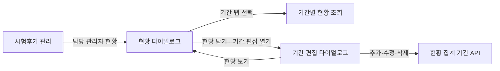

# 시험후기 담당 관리자 현황 기능 작업 문서

> 문서 상태: 프런트엔드 Mock 구현  
> 대상 화면: [`/reviews/exam`](../src/pages/reviews/ExamReviewPage.tsx)  
> 참고 화면: [`/reviews/exam-period`](../src/pages/reviews/ExamReviewPeriodPage.tsx) (작성 가능 기간 관리, 데이터는 분리)

## 1. 한눈에 보기

시험후기 관리자가 시험후기의 전체 확인 진척도와 관리자별 처리 건수를 기간 단위로 확인하는 기능을 추가한다.

- 시험후기 관리 페이지 상단에 `담당 관리자 현황` 버튼을 추가한다.
- 버튼을 누르면 현황 다이얼로그를 연다.
- 관리자가 직접 등록한 현황 집계 기간을 탭으로 제공한다.
- 선택 기간의 전체 건수, 확인 완료 건수, 남은 건수, 확인 완료율을 보여준다.
- 확인 처리한 관리자와 처리 건수, 1인당 평균 처리 건수를 보여준다.
- 현황 다이얼로그에서 `기간 편집`을 누르면 전용 다이얼로그를 열어 커스텀 기간을 추가·수정·삭제한다.



## 2. 배경과 목표

### 현재 문제

- 전체 시험후기 중 확인이 얼마나 완료되었는지 한눈에 보기 어렵다.
- 특정 시험 기간에 어떤 관리자가 몇 건을 처리했는지 별도로 집계해야 한다.
- 기간별 업무 진척도와 관리자별 처리 현황을 같은 기준으로 비교하기 어렵다.

### 목표

1. 선택한 시험 기간의 확인 진행률을 빠르게 파악한다.
2. 실제 확인 처리 이력을 기준으로 관리자별 처리 건수를 확인한다.
3. 관리자가 시험 일정에 맞춰 집계 기간을 직접 추가·수정·삭제할 수 있다.

### 제외 범위

- 관리자 성과 평가, 순위, 목표량 설정
- 관리자에게 시험후기를 직접 배정하는 기능
- 시험후기 확인 처리 방식 자체의 변경
- 현황 데이터 엑셀 다운로드

## 3. 프로젝트 적용 기준

### 3.1 작성 기간과 집계 기간 분리

이 프로젝트에는 이미 `시험 후기 작성 기간` 관리 기능이 있지만, 새 기능의 기간과 목적이 다르므로 데이터를 분리한다.

| 구분      | 시험 후기 작성 기간                               | 담당 관리자 현황 집계 기간            |
| --------- | ------------------------------------------------- | ------------------------------------- |
| 목적      | 일반 사용자가 시험후기를 작성할 수 있는 기간 제어 | 관리자가 현황을 조회할 날짜 범위 설정 |
| 현재 화면 | `/reviews/exam-period`                            | 담당 관리자 현황 다이얼로그           |
| 데이터    | 기존 `ExamReviewPeriod`                           | 신규 `ExamReviewAdminStatusPeriod`    |
| 편집 영향 | 실제 시험후기 작성 가능 여부에 영향               | 통계 조회 범위에만 영향               |

현황 집계 기간을 기존 작성 기간 데이터에 연결하면 관리자가 통계 범위를 수정했을 때 일반 사용자의 시험후기 작성 가능 기간까지 바뀔 수 있다. 따라서 필드 구조가 같더라도 API와 데이터 모델은 분리한다.

### 3.2 기존 UI 기반 재사용

| 구분                       | 적용 방향                                        |
| -------------------------- | ------------------------------------------------ |
| 다이얼로그                 | `shared/components/ui/Dialog` 재사용             |
| 탭·카드·버튼·입력·스켈레톤 | `shared/components/ui` 조합                      |
| 날짜/시간 입력             | 기존 `DateTimePicker`, `useDateTimeField` 재사용 |
| 삭제 확인                  | 기존 확인 다이얼로그 패턴 재사용                 |
| 서버 상태 조회             | TanStack Query로 기간별 캐시와 로딩 상태 관리    |

기간 UI의 형태는 기존 작성 기간 관리 컴포넌트를 참고할 수 있지만, 업무 의미와 API가 다르므로 기존 컴포넌트 안에서 도메인을 조건 분기하지 않는다.

### 3.3 현재 Mock 구현 방식

백엔드 연결 전에도 전체 흐름을 확인할 수 있도록 프런트엔드 mock 서비스를 사용한다.

- 기간 CRUD는 [`exam-admin-status.ts`](../src/domains/Reviews/mocks/exam-admin-status.ts)의 메모리 데이터로 동작한다.
- 커스텀 기간의 현황은 고정된 결과를 반환하지 않고, mock 시험후기의 `createdAt`을 새 기간 범위로 다시 필터링해 계산한다.
- 조회와 저장에는 짧은 지연 시간을 적용해 로딩·중복 제출 상태를 확인할 수 있다.
- 추가·수정·삭제 결과는 TanStack Query 캐시에 즉시 반영한다.
- 데이터는 브라우저 세션 메모리에만 유지되므로 페이지를 새로고침하면 초기 mock 값으로 돌아간다.
- 백엔드가 준비되면 Query·Mutation 훅의 mock 함수 import를 실제 API 함수로 교체한다.

### 3.4 차트 구현

현재 프로젝트에는 차트 라이브러리가 없다. 확인 완료율 도넛은 별도 의존성을 추가하지 않고 다음 중 하나로 구현한다.

- 권장: SVG `<circle>`의 `stroke-dasharray` 사용
- 대안: CSS `conic-gradient`

접근성을 위해 차트만으로 상태를 전달하지 않고, 동일한 값을 숫자와 텍스트로 함께 표시한다.

### 3.5 명칭

- 페이지와 메뉴의 기존 표기에 맞춰 `시험후기`를 붙여 쓴다.
- 사용자가 보는 기능명은 `담당 관리자 현황`으로 통일한다.
- 새 기간 데이터는 코드와 API에서 `현황 집계 기간`으로 구분하고, 다이얼로그에서는 간결하게 `기간`으로 표시한다.
- 기존 `/reviews/exam-period` 데이터의 명칭은 `시험 후기 작성 기간`을 유지한다.
- 관리자는 본명이 아니라 서버가 제공하는 `닉네임`으로 표시한다.

## 4. 사용자 흐름

1. 관리자가 `/reviews/exam`에 진입한다.
2. 페이지 제목 우측의 `담당 관리자 현황` 버튼을 누른다.
3. 다이얼로그를 열고 현황 집계 기간 목록을 조회한다.
4. 기본 선택 기간을 결정한 뒤 해당 기간의 현황을 조회한다.
5. 다른 기간 탭을 누르면 그 기간의 현황으로 전환한다.
6. `기간 편집`을 누르면 현황 다이얼로그를 닫고 기간 편집 전용 다이얼로그를 연다.
7. 기간을 추가·수정·삭제한 뒤 `현황 보기` 또는 닫기를 누르면 편집 다이얼로그를 닫고 갱신된 현황 다이얼로그로 돌아온다.

두 다이얼로그는 동시에 겹쳐 띄우지 않는다. 선택한 `periodId`는 페이지 상태로 유지하고, 두 다이얼로그는 같은 TanStack Query 캐시를 사용한다.

### 기본 기간 선택 순서

1. 현재 시각이 `startAt`과 `endAt` 사이인 진행 중 기간
2. 진행 중 기간이 없으면 가장 최근에 종료된 기간
3. 종료된 기간도 없으면 시작일이 가장 가까운 예정 기간

같은 조건의 기간이 여러 개면 `startAt`이 늦은 기간을 우선한다. 탭은 `startAt` 내림차순으로 표시한다.

## 5. 화면 설계

아래 와이어프레임은 정보 구조와 대략적인 배치를 설명하기 위한 것이며, 실제 구현에서는 프로젝트의 Tailwind와 shadcn 스타일을 따른다.

### 5.1 시험후기 관리 페이지

`PageHeader` 자체를 바로 확장하지 않고, 페이지에서 제목 영역과 액션 버튼을 가로 배치한다. 다른 화면에서도 헤더 액션이 필요해지는 시점에 `PageHeader`의 `actions` prop 공통화를 검토한다.

```text
┌────────────────────────────────────────────────────────────────────────────┐
│ 시험후기 관리                                      [담당 관리자 현황]      │
│ 시험후기를 편집하거나 삭제하고, 경고 및 강등 처리를 할 수 있어요.          │
├────────────────────────────────────────────────────────────────────────────┤
│ 검색 조건                                                                   │
├────────────────────────────────────────────────────────────────────────────┤
│ 시험후기 목록                                                               │
└────────────────────────────────────────────────────────────────────────────┘
```

### 5.2 담당 관리자 현황 다이얼로그

```text
┌────────────────────────────────────────────────────────────────────────────┐
│ 담당 관리자 현황                           [기간 편집]                [×] │
│ 선택한 기간에 등록된 시험후기의 확인 현황입니다.                           │
│                                                                            │
│ [2026-2 기말] [2026-2 중간] [2026 여름] [2026-1 기말] [2026-1 중간] →    │
│ 조회 기간  2026-07-16 00:00 ~ 2026-08-31 23:59                            │
│ ┌──────────────────────────────┐  ┌──────────────────────────────────────┐ │
│ │ 확인 진행률                  │  │ 관리자별 처리 현황       평균 2건  │ │
│ │                              │  │                                      │ │
│ │        ╭──────────╮          │  │ 관리자A                         3건  │ │
│ │       ╱    57%     ╲         │  │ 관리자B                         1건  │ │
│ │       ╲  확인 완료 ╱         │  │                                      │ │
│ │        ╰──────────╯          │  │                                      │ │
│ │                              │  │                                      │ │
│ │  총 시험후기  7건            │  │                                      │ │
│ │  확인 완료    4건            │  │                                      │ │
│ │  남은 후기    3건            │  │                                      │ │
│ └──────────────────────────────┘  └──────────────────────────────────────┘ │
└────────────────────────────────────────────────────────────────────────────┘
```

### 5.3 기간 편집 다이얼로그

```text
┌────────────────────────────────────────────────────────────────────────────┐
│ 기간 편집                                 [현황 보기]                 [×] │
│ 현황 조회에 사용할 기간을 직접 설정합니다.                                 │
│                                                                            │
│ 기간 이름                  시작 일시              종료 일시          관리 │
│ ────────────────────────────────────────────────────────────────────────── │
│ 2026-1학기 중간고사      2026.04.01 00:00      2026.05.15 23:59 [수정][삭제]│
│ 2026-1학기 기말고사      2026.06.01 00:00      2026.07.15 23:59 [수정][삭제]│
│                                                                            │
│ ┌ 수정 중 ───────────────────────────────────────────────────────────────┐ │
│ │ 기간 이름 [2026-1학기 중간고사                                      ] │ │
│ │ 시작 일시 [2026.04.01] [00:00]  종료 일시 [2026.05.15] [23:59]       │ │
│ │                                                     [취소] [저장]     │ │
│ └────────────────────────────────────────────────────────────────────────┘ │
│                                                                            │
│ [+ 기간 추가]                                                              │
└────────────────────────────────────────────────────────────────────────────┘
```

- 목록에서는 기간 이름, 시작 일시, 종료 일시와 수정·삭제 버튼을 표시한다.
- `수정` 또는 `기간 추가`를 누르면 해당 위치에 입력 폼을 표시한다.
- 한 번에 하나의 추가 또는 수정 폼만 활성화한다.
- 삭제는 확인 다이얼로그에서 기간 이름과 날짜를 다시 보여준 뒤 실행한다.

### 5.4 반응형 기준

- 데스크톱: 진행률 카드와 관리자 현황 카드를 2열로 배치한다.
- 좁은 화면: 두 카드를 1열로 쌓는다.
- 기간 탭이 너비를 넘으면 한 줄 가로 스크롤을 제공한다.
- 좁은 화면의 기간 편집 목록은 기간별 카드 형태로 쌓는다.
- 현황 다이얼로그는 `640px` 높이로 고정하되 작은 화면에서는 `85vh`를 넘지 않게 한다.
- 관리자 목록은 기본 6명이 보이는 높이를 유지하고, 7명 이상이면 목록 영역만 세로 스크롤한다.
- 기간 편집 다이얼로그는 `max-h-[85vh]` 수준으로 제한하고 내부만 세로 스크롤한다.
- 닫기, 탭, 다이얼로그 전환, 추가·수정·삭제 버튼은 키보드로 조작할 수 있어야 한다.

## 6. 기능 요구사항

### 6.1 기간 탭

- 현황 집계 기간 조회 API의 결과로 탭을 만든다.
- 탭에는 기간 `title`만 표시한다.
- 선택 기간의 날짜 범위는 기간 탭 바로 아래에 `조회 기간`으로 표시한다.
- 조회 기간 영역은 옅은 배경색과 내부 여백을 적용해 탭과 현황 카드를 구분한다.
- 조회 기간은 연도와 시간을 포함해 `YYYY-MM-DD HH:mm ~ YYYY-MM-DD HH:mm` 형식으로 표시한다.
- 탭을 바꾸면 선택한 `periodId`의 현황을 조회한다.
- 탭 전환 중에는 이전 기간의 수치를 새 기간의 수치처럼 보이지 않게 카드에 로딩 상태를 표시한다.
- 등록된 기간이 없으면 빈 상태와 `기간 추가` 버튼을 표시한다.

### 6.2 기간 추가·수정·삭제

#### 공통 입력 항목

- 기간 이름 `title`
- 시작 일시 `startAt`
- 종료 일시 `endAt`

#### 유효성 검사

- 기간 이름과 시작·종료 일시는 모두 필수다.
- 기간 이름은 앞뒤 공백을 제거한 뒤 저장하며, 공백만 입력할 수 없다.
- 시작 일시는 종료 일시보다 빨라야 한다.
- 탭을 구분할 수 있도록 같은 기간 이름의 중복 저장을 허용하지 않는다.
- 기간이 서로 겹치는 것은 허용한다. 각 기간은 독립적인 조회 조건이므로 같은 시험후기가 여러 기간의 현황에 포함될 수 있다.

#### 추가

- `+ 기간 추가`를 누르면 목록 하단에 빈 입력 폼을 표시한다.
- 저장 성공 후 기간 목록을 다시 조회하고 생성된 기간을 선택한다.
- 생성 API는 안정적인 선택을 위해 생성된 `periodId`를 응답해야 한다.
- 취소하면 입력값을 버리고 추가 폼을 닫는다.

#### 수정

- 수정 버튼을 누르면 해당 행을 인라인 입력 폼으로 전환한다.
- 취소하면 서버 요청 없이 기존 값으로 되돌린다.
- 저장 성공 후 같은 `periodId`를 유지하고 기간 목록과 해당 기간의 현황을 다시 조회한다.
- 변경된 값이 없으면 저장 버튼을 비활성화한다.

#### 삭제

- 삭제 전에 기간 이름과 범위를 포함한 확인 다이얼로그를 표시한다.
- 집계 기간 삭제는 시험후기 원본이나 확인 이력을 삭제하지 않는다.
- 선택 중인 기간을 삭제하면 기본 기간 선택 규칙으로 다음 기간을 선택한다.
- 마지막 기간을 삭제하면 기간 없음 상태를 표시한다.

#### 저장하지 않은 입력

- 추가 또는 수정 중에는 다른 행의 편집을 시작하지 못하게 한다.
- 저장하지 않은 변경이 있을 때 현황 다이얼로그로 돌아가거나 편집 다이얼로그를 닫으면 변경 내용을 버릴지 확인한다.
- 저장 요청 중에는 해당 폼과 편집 다이얼로그 닫기 버튼을 비활성화해 중복 요청을 막는다.

### 6.3 집계 기준

| 항목             | 기준                                                                 |
| ---------------- | -------------------------------------------------------------------- |
| 기간 포함 여부   | 서버 저장 시각 기준으로 `startAt <= review.createdAt <= endAt`       |
| 총 시험후기      | 선택 기간에 생성된 전체 시험후기 수                                  |
| 확인 완료        | 선택 기간 시험후기 중 현재 `isConfirmed=true`인 수                   |
| 남은 후기        | `총 시험후기 - 확인 완료`                                            |
| 확인 완료율      | `확인 완료 / 총 시험후기 * 100`                                      |
| 관리자 처리 건수 | 현재 확인 완료인 후기의 가장 최근 `false -> true` 변경 관리자별 건수 |
| 관리자 노출 기준 | 처리 건수가 1건 이상인 관리자                                        |
| 관리자 표시명    | 관리자 닉네임                                                        |
| 평균 처리 건수   | `관리자에게 귀속된 확인 완료 건수 / 노출 관리자 수`의 올림 값        |

시험후기의 확인 처리 시점이 선택 기간 밖이어도, 해당 시험후기의 `createdAt`이 선택 기간에 포함되면 그 기간의 처리 건수로 집계한다.

### 6.4 상태가 여러 번 변경된 경우

- `미확인 -> 확인`으로 바뀐 경우에만 처리 이력으로 인정한다.
- 확인 상태를 유지한 채 다른 필드만 수정한 것은 처리 건수에 포함하지 않는다.
- `확인 -> 미확인 -> 확인`으로 변경되었고 현재 확인 상태라면 가장 최근에 확인 처리한 관리자에게 1건을 귀속한다.
- 현재 미확인 상태라면 과거에 확인한 적이 있어도 확인 완료와 관리자 처리 건수에 포함하지 않는다.
- 한 시험후기는 현재 현황에서 최대 한 명의 관리자에게 1건만 귀속된다.

이 규칙을 적용하면 관리자별 처리 건수의 중복 합산을 방지하면서 현재 확인 완료 상태와 처리 주체를 일치시킬 수 있다.

### 6.5 숫자 표시 규칙

- 확인 완료율은 정수로 반올림하고 `0~100%` 범위를 보장한다.
- 총 시험후기가 0건이면 확인 완료율은 `0%`다.
- 1인당 평균은 소수점이 발생하면 올림한다.
- 처리 관리자가 없으면 평균은 `-`로 표시하고 `처리 내역이 없습니다.`를 보여준다.
- 관리자 목록은 `처리 건수 내림차순 -> 닉네임 오름차순`으로 정렬한다.
- 모든 건수는 음수가 될 수 없고 `확인 완료 + 남은 후기 = 총 시험후기`를 만족해야 한다.

### 6.6 담당자를 확인할 수 없는 과거 데이터

확인 완료 상태이지만 처리 관리자 이력이 없는 데이터가 있을 수 있다.

- 요약의 확인 완료 건수에는 포함한다.
- 관리자 목록 하단에 `담당자 미상 N건`을 별도로 표시한다.
- 1인당 평균의 분자와 분모에서는 제외한다.
- API는 `unassignedCount`로 해당 수를 명시한다.

정상 데이터에서는 다음 관계를 만족해야 한다.

```text
confirmedCount = sum(managers[].processedCount) + unassignedCount
```

## 7. 상태별 UI

| 상태             | 표시 내용                                              |
| ---------------- | ------------------------------------------------------ |
| 기간 조회 중     | 탭과 카드 영역 스켈레톤                                |
| 기간 없음        | `등록된 현황 집계 기간이 없습니다.` + `기간 추가` 버튼 |
| 기간 저장 중     | 편집 폼 비활성화와 저장 진행 상태                      |
| 기간 저장 실패   | 입력값을 유지하고 폼 안에 오류 문구 표시               |
| 현황 조회 중     | 선택 탭은 유지하고 두 카드만 스켈레톤 처리             |
| 시험후기 0건     | 도넛 `0%`, 세 건수 `0건`, 관리자 빈 상태               |
| 관리자 0명       | `처리 내역이 없습니다.`, 평균 `-`                      |
| 담당자 미상 존재 | 관리자 목록 하단에 `담당자 미상 N건` 안내              |
| 조회 실패        | 카드 안에 오류 문구와 `다시 시도` 버튼                 |

다이얼로그를 닫았다 다시 열 때는 TanStack Query의 캐시를 먼저 사용하되, 설정된 `staleTime` 이후에는 다시 조회한다.

## 8. API 계약 제안

아래 내용은 백엔드 연결 시 사용할 계약 제안이다. 현재 프런트엔드에서는 같은 입출력 타입을 가진 mock 서비스로 대체한다. 현황 집계 기간은 기존 작성 기간과 분리된 신규 API를 사용한다.

### 8.1 현황 집계 기간 CRUD

| 기능      | 메서드와 경로                                              | 응답 `result`                   |
| --------- | ---------------------------------------------------------- | ------------------------------- |
| 목록 조회 | `GET /v1/admin/reviews/admin-status/periods`               | `ExamReviewAdminStatusPeriod[]` |
| 기간 추가 | `POST /v1/admin/reviews/admin-status/periods`              | 생성된 기간                     |
| 기간 수정 | `PATCH /v1/admin/reviews/admin-status/periods/{periodId}`  | 수정된 기간                     |
| 기간 삭제 | `DELETE /v1/admin/reviews/admin-status/periods/{periodId}` | 삭제한 `periodId`               |

추가·수정 요청 본문은 다음 형식을 사용한다.

```json
{
  "title": "2026-1학기 중간고사",
  "startAt": "2026-04-01T00:00:00",
  "endAt": "2026-05-15T23:59:00"
}
```

기간 응답은 `id`, `title`, `startAt`, `endAt`, `createdAt`, `updatedAt`을 포함한다. 생성 직후 새 기간을 정확히 선택할 수 있도록 추가 API는 생성된 기간의 `id`를 반드시 반환한다.

### 8.2 기간별 관리자 현황 조회

관리자 현황은 페이지네이션된 시험후기 목록을 프런트에서 모두 모아 계산하지 않고, 서버 집계 API를 사용한다.

프런트 집계가 적합하지 않은 이유는 다음과 같다.

- 현재 시험후기 목록 API는 페이지네이션되어 전체 건수를 한 번에 얻을 수 없다.
- 관리자 처리 주체를 정하려면 단순 현재 상태가 아니라 변경 이력을 확인해야 한다.
- 같은 집계 규칙을 프런트와 서버에 중복 구현하면 값이 달라질 수 있다.

#### 요청

```http
GET /v1/admin/reviews/admin-status/periods/{periodId}/summary
```

#### 응답 예시

```json
{
  "isSuccess": true,
  "code": 200,
  "message": "성공입니다.",
  "result": {
    "period": {
      "id": 12,
      "title": "2026-1학기 중간고사",
      "startAt": "2026-04-01T00:00:00",
      "endAt": "2026-05-15T23:59:00"
    },
    "summary": {
      "totalCount": 7,
      "confirmedCount": 4,
      "unconfirmedCount": 3,
      "unassignedCount": 0
    },
    "managers": [
      {
        "encryptedAdminId": "encrypted-admin-id-1",
        "nickname": "관리자A",
        "processedCount": 3
      },
      {
        "encryptedAdminId": "encrypted-admin-id-2",
        "nickname": "관리자B",
        "processedCount": 1
      }
    ]
  }
}
```

확인 완료율과 평균은 응답의 원본 건수로 프런트에서 계산한다. 서버와 프런트 중 한쪽만 계산 규칙을 소유하도록 하려면 두 값도 서버 응답으로 제공할 수 있지만, 그 경우 API 문서에 반올림·올림 정책을 함께 고정해야 한다.

### 8.3 오류 처리

| 상황                     | 기대 동작                                                   |
| ------------------------ | ----------------------------------------------------------- |
| 필수값 누락·잘못된 범위  | `400`, 기간 편집 폼에 검증 오류 표시                        |
| 중복된 기간 이름         | `409`, 입력값을 유지하고 중복 안내                          |
| 존재하지 않는 `periodId` | `404`, 다이얼로그에 조회 실패 표시                          |
| 권한 없음                | 기존 axios 인증/권한 처리 정책 사용                         |
| 집계 실패                | `5xx`, 다시 시도 가능                                       |
| 닉네임 없음              | `unassignedCount`에 포함하거나 서버 정책에 따른 대체명 제공 |

## 9. 프런트엔드 구현 설계

### 수정한 기존 파일

- [`src/pages/reviews/ExamReviewPage.tsx`](../src/pages/reviews/ExamReviewPage.tsx)
  - 페이지 상단 버튼과 다이얼로그 열림 상태 추가
- [`src/domains/Reviews/types/exam.ts`](../src/domains/Reviews/types/exam.ts)
  - 현황 집계 기간과 현황 응답 타입 추가
- [`src/domains/Reviews/components/index.ts`](../src/domains/Reviews/components/index.ts)
  - 신규 컴포넌트 export

### 추가한 주요 파일

```text
src/domains/Reviews/
├─ components/
│  ├─ ExamReviewAdminStatusDialog.tsx
│  ├─ ExamReviewAdminStatusPeriodDialog.tsx
│  ├─ ExamReviewAdminStatusPeriodEditor.tsx
│  ├─ ExamReviewProgressChart.tsx
│  └─ ExamReviewAdminStatusList.tsx
└─ hooks/
   ├─ use-exam-review-admin-status-periods.ts
   └─ use-exam-review-admin-status.ts

src/domains/Reviews/
├─ mocks/exam-admin-status.ts
├─ utils/exam-admin-status.ts
├─ components/ExamReviewAdminStatusDialog.test.tsx
├─ mocks/exam-admin-status.test.ts
└─ utils/exam-admin-status.test.ts
```

백엔드가 준비되면 [`src/apis/reviews.ts`](../src/apis/reviews.ts)에 실제 API 함수를 추가하고 두 Query 훅의 mock 함수 import를 교체한다.

역할은 다음처럼 나눈다.

| 단위                                   | 책임                                                  |
| -------------------------------------- | ----------------------------------------------------- |
| `ExamReviewAdminStatusDialog`          | 기본 탭 선택, 기간별 현황 레이아웃과 상태 분기        |
| `ExamReviewAdminStatusPeriodDialog`    | 편집 다이얼로그 열림·닫힘, 미저장 변경 확인           |
| `ExamReviewAdminStatusPeriodEditor`    | 기간 목록, 추가·인라인 수정·삭제, 입력 검증           |
| `ExamReviewProgressChart`              | 도넛과 요약 수치 표시                                 |
| `ExamReviewAdminStatusList`            | 관리자 목록, 평균, 담당자 미상 표시                   |
| `use-exam-review-admin-status-periods` | 기간 조회·추가·수정·삭제 Mutation과 Query 캐시 무효화 |
| `use-exam-review-admin-status`         | 선택 기간의 서버 상태 조회와 Query 캐시               |

권장 Query Key는 다음과 같다.

```ts
['examReviewAdminStatusPeriods'];
['examReviewAdminStatus', periodId];
```

다이얼로그가 열렸을 때만 기간 목록을 조회하고, `periodId`가 정해진 경우에만 현황 조회를 활성화한다. 기간 수정 성공 시 목록과 해당 기간 현황을 무효화하고, 삭제 성공 시 삭제된 기간의 현황 캐시를 제거한다.

### 계산 유틸리티

표시 계산은 테스트 가능한 순수 함수로 분리한다.

```ts
getCompletionRate(confirmedCount, totalCount); // 정수, 0~100
getAverageProcessedCount(managers); // 정수 또는 null
```

평균 계산에는 `confirmedCount`를 그대로 쓰지 않고 `managers[].processedCount`의 합계를 사용한다. 그러면 `unassignedCount`가 있는 과거 데이터가 관리자 평균을 부풀리지 않는다.

## 10. 구현 순서

1. 백엔드와 집계 기간 CRUD 및 현황 응답 계약을 확정한다.
2. 현황 집계 기간 타입, API 함수와 Query·Mutation 훅을 추가한다.
3. 기간 편집 목록과 추가·수정·삭제 동작을 구현한다.
4. 진행률 차트와 관리자 목록을 각각 구현한다.
5. 현황 다이얼로그의 기간 탭과 기간 편집 다이얼로그 전환을 연결한다.
6. 시험후기 관리 페이지에 진입 버튼을 추가한다.
7. 단위·컴포넌트 테스트 후 빌드와 린트를 확인한다.

## 11. 테스트 항목

### 계산 단위 테스트

- `4 / 7`의 확인 완료율이 `57%`인가?
- 전체가 0건일 때 확인 완료율이 `0%`인가?
- `7건 / 2명`의 평균이 `4건`인가?
- 담당자 미상 건수가 평균에서 제외되는가?
- 음수나 비정상 응답이 화면에 그대로 노출되지 않는가?

### 컴포넌트 테스트

- 버튼을 누르면 다이얼로그가 열리는가?
- 기본 선택 기간 규칙이 적용되는가?
- 탭을 변경하면 해당 `periodId`로 다시 조회하는가?
- 기간을 추가하면 목록에 반영되고 새 기간이 선택되는가?
- 기간 수정 시 유효성 검사가 적용되고 현황이 다시 조회되는가?
- 선택한 기간과 마지막 남은 기간을 삭제했을 때 각각 올바른 상태가 되는가?
- 저장하지 않은 변경이 있을 때 현황으로 돌아가기·닫기 확인이 표시되는가?
- 로딩·빈 데이터·오류·재시도 상태가 올바르게 보이는가?
- 관리자 목록이 건수와 닉네임 기준으로 정렬되는가?
- 다이얼로그를 키보드로 열고 닫을 수 있는가?

### 회귀 확인

- 기존 시험후기 검색, 페이지네이션, 상세 선택 및 수정에 영향이 없는가?
- 신규 집계 기간 CRUD가 기존 시험 후기 작성 기간에 영향을 주지 않는가?
- 기존 `/reviews/exam-period`의 생성·조회·수정·삭제가 그대로 동작하는가?
- 작은 화면에서 다이얼로그 내용과 탭에 접근할 수 있는가?

## 12. 완료 조건

- [ ] 시험후기 관리 페이지에서 현황 다이얼로그를 열 수 있다.
- [ ] 커스텀 집계 기간을 추가·수정·삭제할 수 있다.
- [ ] 등록한 집계 기간이 탭으로 노출되고 기본 기간이 올바르게 선택된다.
- [ ] 기간별 총 건수, 확인 완료, 남은 후기, 완료율이 정확하다.
- [ ] 관리자별 처리 건수와 1인당 평균이 집계 기준에 맞다.
- [ ] 0건, 관리자 없음, 담당자 미상, 오류 상태를 처리한다.
- [ ] 집계 기간 변경이 기존 시험 후기 작성 기간에 영향을 주지 않는다.
- [ ] 차트에 별도 런타임 의존성을 추가하지 않는다.
- [ ] 관련 단위·컴포넌트 테스트가 통과한다.
- [ ] `npm run lint`와 `npm run build`가 통과한다.

## 13. 구현 전 확인할 사항

다음 세 항목은 백엔드와 최종 확인한 뒤 구현한다.

1. 기존 시험후기 변경 로그만으로 모든 `미확인 -> 확인` 처리 관리자와 닉네임을 복원할 수 있는가?
2. 삭제·숨김 상태의 시험후기도 `총 시험후기`와 `남은 후기`에 포함하는가?
3. 집계 기간과 시험후기 `createdAt` 비교는 KST와 UTC 중 어느 시간대를 기준으로 하는가?

현재 문서는 초안의 정의대로 **선택 기간에 생성된 모든 시험후기**를 총 건수에 포함하는 것으로 작성했다. 삭제·숨김 시험후기를 업무 대상에서 제외해야 한다면 API 집계 조건, 요약 문구, 테스트 기대값을 함께 변경해야 한다.
